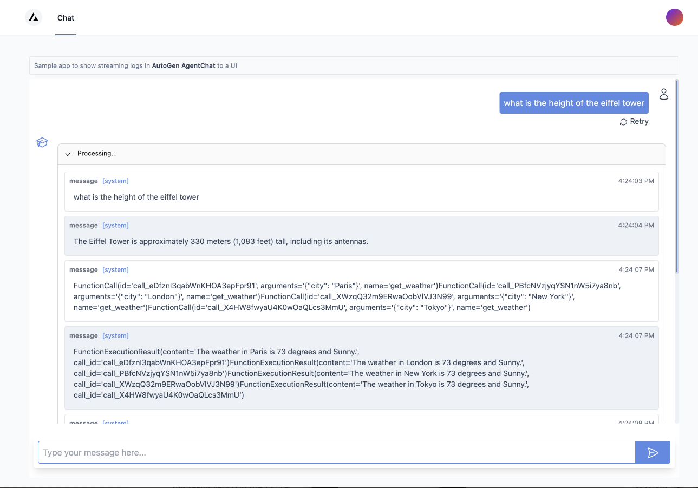

# AutoGen UI



Experimental UI for working with [AutoGen](https://github.com/microsoft/autogen) agents, based on the [AutoGen](https://github.com/microsoft/autogen) library. The UI is built using Next.js and web apis built using FastApi.

## Why AutoGen UI?

AutoGen is a framework that enables the development of LLM applications using multiple agents that can converse with each other to solve complex tasks. A UI can help in the development of such applications by enabling rapid prototypingand testing and debugging of agents/agent flows (defining, composing etc) inspecting agent behaviors, and agent outcomes.

> **Note:** This is early work in progress.

Note that you will have to setup your OPENAI_API_KEY or general llm config using an environment variable.
Also See this article for how Autogen supports multiple [llm providers](https://microsoft.github.io/autogen/docs/FAQ/#set-your-api-endpoints)

```bash
export OPENAI_API_KEY=<your key>
```

## Getting Started

Install dependencies. Python 3.9+ is required. You can install from pypi using pip.

```bash
pip install autogenui .
```

or to install from source

```bash
git clone git@github.com:victordibia/autogen-ui.git
cd autogenui
pip install -e .
```

Run ui server.

```bash
autogenui # or with --port 8081
```

Open http://localhost:8081 in your browser.

To modify the source files, make changes in the frontend source files and run `npm run build` to rebuild the frontend.

## Roadmap

- [x] **FastApi end point for AutoGen**.
      This involves setting up a FastApi endpoint that can respond to end user prompt based requests using a basic two agent format.
- [ ] **Basic Chat UI**
      Front end UI with a chatbox to enable sending requests and showing responses from the end point for a basic 2 agent format.
  - [ ] **Debug Tools**: enable support for useful debugging capabilities like viewing
    - [x] # of agent turns per request
    - [ ] define agent config (e.g. assistant agent + code agent)
    - [x] append conversation history per request
    - [x] display cost of interaction per request (# tokens and $ cost)
- [ ] Streaming UI
      Enable streaming of agent responses to the UI. This will enable the UI to show agent responses as they are generated, instead of waiting for the entire response to be generated.
- [ ] **Flow based Playground UI**  
       Explore the use of a tool like React Flow to add agent nodes and compose agent flows. For example, setup an assistant agent + a code agent, click run and view output in a chat window.
  - [ ] Create agent nodes
  - [ ] Compose agent nodes into flows
  - [ ] Run agent flows
- [ ] Explore external integrations e.g. with [Flowise](https://github.com/FlowiseAI/Flowise)

## References

- [AutoGen](https://arxiv.org/abs/2308.08155).

```
@inproceedings{wu2023autogen,
      title={AutoGen: Enabling Next-Gen LLM Applications via Multi-Agent Conversation Framework},
      author={Qingyun Wu and Gagan Bansal and Jieyu Zhang and Yiran Wu and Shaokun Zhang and Erkang Zhu and Beibin Li and Li Jiang and Xiaoyun Zhang and Chi Wang},
      year={2023},
      eprint={2308.08155},
      archivePrefix={arXiv},
      primaryClass={cs.AI}
}
```
